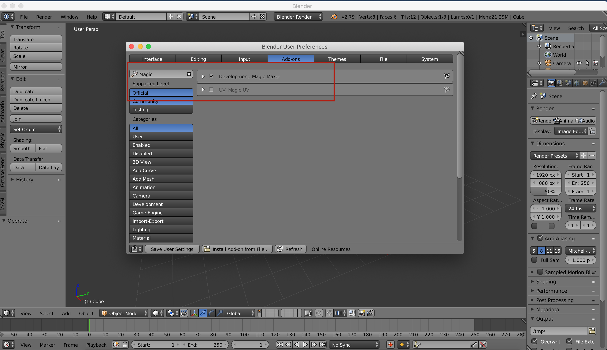
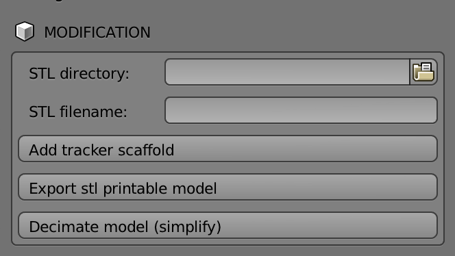
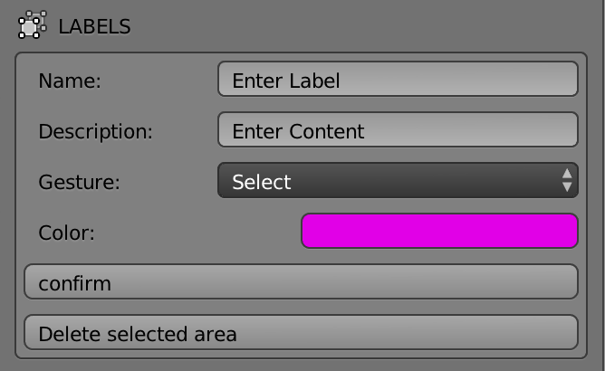
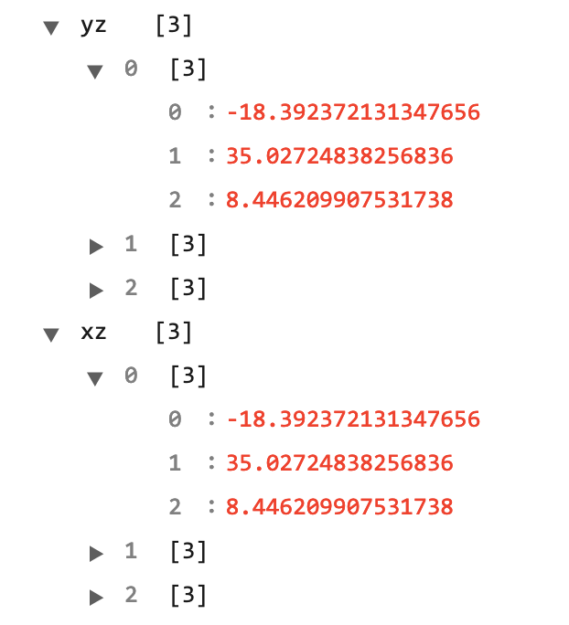
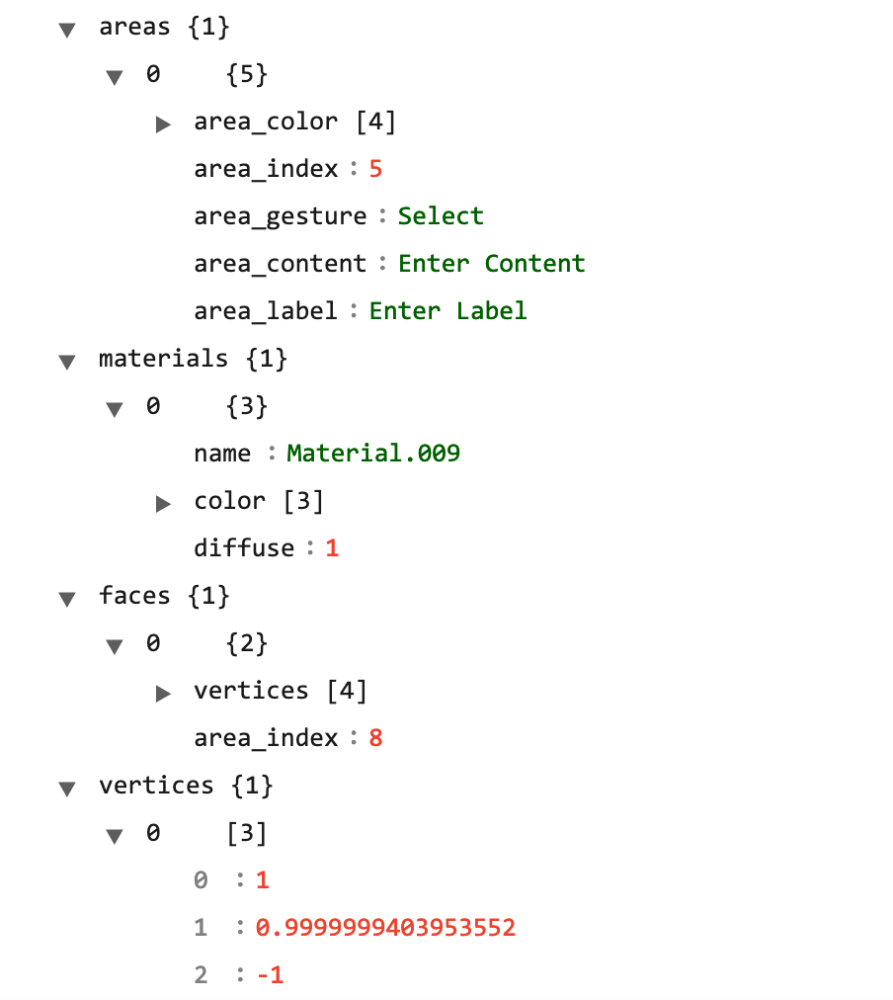

# MAGIC_I3M
MAGIC_I3M is a blender add-on in which users can label 3d models to make them interactable with Talkit ++, an application that plays audio and visual content as a user touches parts of a 3D print. For more information, check out: [Talkit++](https://github.com/saltfishzzh/Talkit)

## Dependencies

You should be using these tools:

1. Blender 2.78

## Getting started
To install the add-on you only need the vanilla version of Blender to start labelling models!

Link to blender latest version: https://www.blender.org/download/

### Addon installation
This section covers briefly how to install an add-on in Blender:

- On the top left corner of your screen click the file tab and then go to your user preferences, 

- Click the button install add-on from file, 

- Look for the add-on file in your computer (Usually under downloads or where you cloned the project), 

- Finally, look for the add-on and activate it 

If you did everything correctly, you should be able to see this tool kit (using the default interface):

### Tutorial on how to use the tool
- In this google drive folder https://drive.google.com/drive/folders/1KE6KdNvfaFP7SPK8YQNnWqTsNPT6tJnB?usp=sharing you can access to a small tutorial on how to do create your first I3M. Follow the instructions in the google slides. Don't hesitate to contact the creators (At the bottom of this readme) if you have any questions.

## Usage

The addon contains 3 modules with 7 functionalities:

### Modification module

In this module you have access to 3 functionalities:
- Adding the tracker scaffold. This tracker scaffold needs to be added to every model in blender so we can map the model with talkit++ and make the model detectable.
- Exporting to an stl file. STL is the standar format used for 3D printing
- Decimate model. This function allows us to simplify the model being used, making it lightweight and easy to use. (Note: Don't use this function after adding the tracker scaffold!)

### Labeling module

In this module you have access to 2 functionalities:
- You can select any number of faces on the model and add a label by inputing a name, a description and selecting a color and then clicking on the confirm button. A label will be created and automatically linked to the selected faces.
- You can select any number of faces on the model and click on the delete selected area button. You only need to select 1 face of the corresponding area to delete that label. E.G: You select 3 faces of your object and label them, then you want to delete this action. You select only 1 of the previously labeled faces and click on the delete button. Finally all the 3 faces should lose their color, indicating that the label was deleted.

### Export and import module

In this module you have access to 2 functionalities:
- You can export the selected (1) object as a json file to share your work with other designers and users, so they can reuse and relabel your model.
- You can import a model providing a json file with the format explained above. You only need to provide the file path in your computer and click the import button.

## Implementation
### JSON data structure
There are 2 important sections in our json file.
#### XZ and YZ planes

We use these XZ and YZ planes (Composed of 3 vertices each one of them) so that talkit++ can use this constant point of reference to map the model and assign the audio labels in realtime.

TODO: Elaborate more in the explanation and show more images.
#### Vertices, faces, areas and materials.

To rebuild the model we need 4 pieces of information. 
- Vertices, which represent each point in the model. 
- Faces, which are composed with 3 or more vertices and make carcass of the model. 
- Materials, which help us with the labeling of the model (Gives color too). 
- Areas, which contain the information about the label

## Contact

If you have any question about using the project, please contact Lei Shi (ls776@cornell.edu) or Ricardo Gonzalez (rgonzalezp1115@gmail.com). They would be happy to explain the project to you.	

## Credits
This add-on was developed in Cornell Tech under professor Shiri Azenkot supervision.
